# 🏛️ Platform Architecture

Deep dive into the K3s MLOps Platform architecture and design decisions.

## 🎯 **Architecture Overview**

```
┌─────────────────────────────────────────────────────────────────┐
│                   K3s MLOps Platform Architecture               │
├─────────────────────────────────────────────────────────────────┤
│                                                                 │
│  ┌─────────────────┐  ┌─────────────────┐  ┌─────────────────┐ │
│  │   Data Science  │  │   ML Lifecycle  │  │  Model Serving  │ │
│  │                 │  │                 │  │                 │ │
│  │   JupyterHub    │  │     MLflow      │  │  Seldon Core    │ │
│  │   (Development) │  │   (Tracking)    │  │  (Inference)    │ │
│  └─────────────────┘  └─────────────────┘  └─────────────────┘ │
│           │                     │                     │         │
│           └─────────────────────┼─────────────────────┘         │
│                                 │                               │
│  ┌─────────────────┐  ┌─────────────────┐  ┌─────────────────┐ │
│  │   Orchestration │  │    Monitoring   │  │     GitOps      │ │
│  │                 │  │                 │  │                 │ │
│  │ Argo Workflows  │  │ Prometheus +    │  │    Argo CD      │ │
│  │   Kubeflow      │  │    Grafana      │  │   (Deploy)      │ │
│  └─────────────────┘  └─────────────────┘  └─────────────────┘ │
│                                                                 │
│  ─────────────────────────────────────────────────────────────  │
│                        Infrastructure Layer                     │
│  ┌─────────────────┐  ┌─────────────────┐  ┌─────────────────┐ │
│  │   Kubernetes    │  │     Storage     │  │    Security     │ │
│  │                 │  │                 │  │                 │ │
│  │  K3s Cluster    │  │ MinIO (S3) +    │  │ Sealed Secrets  │ │
│  │  (Compute)      │  │ Local Storage   │  │   RBAC + TLS    │ │
│  └─────────────────┘  └─────────────────┘  └─────────────────┘ │
└─────────────────────────────────────────────────────────────────┘
```

## 🏗️ **Component Architecture**

### **Control Plane (K3s Master)**
- **Role**: Cluster management, API server, etcd, scheduler
- **Resources**: 4GB RAM, 2 CPU cores, 40GB storage
- **Services**: K3s API, etcd, controller-manager, scheduler

### **Worker Nodes**
- **Role**: Workload execution, storage, networking
- **Resources**: 8GB+ RAM, 4+ CPU cores, 100GB+ storage  
- **Services**: kubelet, kube-proxy, container runtime

### **Storage Architecture**
```
Storage Layer:
├── Local Path Storage (K3s default)
│   ├── Pod ephemeral storage
│   ├── Small persistent volumes
│   └── Config maps and secrets
│
├── MinIO Object Storage (S3-compatible)
│   ├── MLflow artifacts
│   ├── Model binaries
│   ├── Dataset storage
│   └── Pipeline artifacts
│
└── NFS Storage (optional)
    ├── Shared notebooks
    ├── Large datasets
    └── Cross-node file sharing
```

### **Network Architecture**
```
Network Layer:
├── Pod Network (10.42.0.0/16)
│   ├── Flannel VXLAN overlay
│   ├── Pod-to-pod communication
│   └── Service discovery
│
├── Service Network (10.43.0.0/16)  
│   ├── ClusterIP services
│   ├── DNS resolution
│   └── Load balancing
│
└── External Access
    ├── NodePort services (30000-32767)
    ├── Traefik ingress (optional)
    └── Load balancer integration
```

## 🔄 **MLOps Workflow Architecture**

### **Development to Production Pipeline**

```mermaid
graph LR
    A[Data Scientist] --> B[JupyterHub]
    B --> C[MLflow Tracking]
    C --> D[Model Registry]
    D --> E[Argo Workflows]
    E --> F[Model Validation]
    F --> G[ArgoCD Deployment]
    G --> H[Seldon Core Serving]
    H --> I[Prometheus Monitoring]
    I --> J[Grafana Dashboards]
```



### **Data Flow Architecture**
```
Data Pipeline:
┌─────────────┐    ┌─────────────┐    ┌─────────────┐
│   Raw Data  │───▶│  Processing │───▶│  Features   │
│   (MinIO)   │    │   (Argo)    │    │   (MinIO)   │
└─────────────┘    └─────────────┘    └─────────────┘
       │                  │                  │
       ▼                  ▼                  ▼
┌─────────────┐    ┌─────────────┐    ┌─────────────┐
│   Training  │───▶│   Models    │───▶│ Inference   │
│   (Jupyter) │    │  (MLflow)   │    │  (Seldon)   │
└─────────────┘    └─────────────┘    └─────────────┘
```

## 🔒 **Security Architecture**

### **Authentication & Authorization**
```
Security Layer:
├── Kubernetes RBAC
│   ├── Service accounts
│   ├── Role bindings
│   └── Cluster roles
│
├── Sealed Secrets
│   ├── Encrypted at rest
│   ├── GitOps compatible  
│   └── Auto-decryption
│
└── Network Security
    ├── Namespace isolation
    ├── Network policies (optional)
    └── TLS certificates
```

### **Secret Management Flow**
```
Secret Lifecycle:
Create Secret → Seal with Public Key → Store in Git → Deploy to Cluster → Auto-Decrypt
     ↑              ↑                    ↑              ↑               ↑
  Developer    Sealed Secret         GitOps Repo     ArgoCD        Private Key
```

## 📊 **Monitoring Architecture**

### **Observability Stack**
```
Monitoring Pipeline:
┌─────────────┐    ┌─────────────┐    ┌─────────────┐
│   Metrics   │───▶│ Prometheus  │───▶│   Grafana   │
│ (Exporters) │    │ (Storage)   │    │ (Visualization)│
└─────────────┘    └─────────────┘    └─────────────┘
       │                  │                  │
       ▼                  ▼                  ▼
┌─────────────┐    ┌─────────────┐    ┌─────────────┐
│    Logs     │───▶│   Alerting  │───▶│ Dashboards  │
│ (Optional)  │    │ (Optional)  │    │  (Custom)   │
└─────────────┘    └─────────────┘    └─────────────┘
```

### **Metrics Collection Points**
- **Infrastructure**: Node metrics, pod resources, cluster health
- **Applications**: MLflow experiments, model performance, pipeline success rates
- **Business**: Model accuracy, prediction latency, user engagement

## 🚀 **Scaling Architecture**

### **Horizontal Scaling**
```
Scale-Out Strategy:
├── Worker Nodes
│   ├── Add nodes to inventory
│   ├── Run Ansible playbook
│   └── Automatic pod distribution
│
├── Stateless Services
│   ├── Increase replica count
│   ├── Load balancer distribution
│   └── Auto-scaling (HPA)
│
└── Storage Scaling
    ├── Add MinIO nodes
    ├── Distributed storage
    └── Replication factor
```

### **Vertical Scaling**
- **Resource Limits**: Increase CPU/memory per pod
- **Node Upgrades**: More powerful hardware
- **Storage Expansion**: Larger volumes per node

## 🔧 **Technology Decisions**

### **Why K3s over K8s?**
- **Simplicity**: Single binary installation
- **Resource Efficiency**: Lower memory footprint
- **Edge-Friendly**: IoT and edge computing ready
- **Production-Ready**: CNCF certified Kubernetes

### **Why MinIO over Cloud Storage?**
- **On-Premises**: Full data control
- **S3 Compatibility**: Drop-in replacement
- **Performance**: Local network speeds
- **Cost**: No egress charges

### **Why Argo over Other Orchestrators?**
- **Kubernetes-Native**: CRD-based workflows
- **GitOps**: Git as source of truth
- **DAG Support**: Complex workflow dependencies
- **Observability**: Built-in monitoring

## 📈 **Performance Characteristics**

### **Typical Resource Usage**
```
Component Resource Profile:
├── MLflow: 0.5 CPU, 1GB RAM
├── JupyterHub: 0.2 CPU, 512MB RAM (hub)
├── Argo Workflows: 0.1 CPU, 256MB RAM
├── ArgoCD: 0.3 CPU, 512MB RAM
├── Prometheus: 1 CPU, 2GB RAM
├── Grafana: 0.2 CPU, 256MB RAM
└── MinIO: 0.5 CPU, 1GB RAM
```

### **Scaling Limits**
- **Nodes**: Up to 100 nodes (K3s limit)
- **Pods**: ~100 pods per node
- **Storage**: Limited by disk space
- **Network**: 1Gbps recommended minimum

## 🔄 **Disaster Recovery**

### **Backup Strategy**
```
Backup Architecture:
├── etcd Snapshots (K3s state)
├── MinIO Data (S3 sync)
├── PVC Snapshots (persistent data)
└── GitOps Repo (configuration)
```

### **Recovery Procedures**
1. **Cluster Recovery**: Restore from etcd snapshot
2. **Data Recovery**: Restore MinIO buckets
3. **Application Recovery**: ArgoCD redeploy from Git
4. **Secret Recovery**: Sealed secrets auto-decrypt

---

## 🎯 **Architecture Benefits**

**✅ Scalability**: Horizontal and vertical scaling
**✅ Reliability**: High availability and fault tolerance  
**✅ Security**: Enterprise-grade secret management
**✅ Observability**: Comprehensive monitoring
**✅ Maintainability**: GitOps and Infrastructure as Code
**✅ Cost-Effectiveness**: Open source stack

**This architecture demonstrates enterprise-level platform engineering capabilities suitable for production MLOps at scale.** 🏆
