# Enterprise Secret Management in MLOps: Kubernetes Security at Scale

*From Sealed Secrets to production-ready MLOps platforms: implementing enterprise-grade credential management*

---

## The Hidden Challenge in MLOps Infrastructure

When building MLOps platforms, most engineers focus on the exciting parts: model training pipelines, deployment automation, and monitoring dashboards. But there's a less glamorous aspect that can make or break your entire platform: **secret management**.

While building my [Fortune 500-grade MLOps stack in my homelab](https://jeftaylo.medium.com/from-devops-to-mlops-why-employers-care-and-how-i-built-a-fortune-500-stack-in-my-spare-bedroom-ce0d06dd3c61), I knew from experience that naive secret management approaches create security vulnerabilities, operational headaches, and team friction that can derail even the most well-architected MLOps platforms. The challenge wasn't understanding the problem—it was working through the nuances and implementation details to get it right, from installing Sealed Secrets with Helm in Ansible playbooks to scripting the final distribution system.

The complete infrastructure implementation discussed in this article is available in my [ml-platform repository](https://github.com/jtayl222/ml-platform), a production-ready MLOps platform built on Kubernetes featuring comprehensive secret management, experiment tracking, and model serving capabilities.

This article explores how to implement enterprise-grade secret management that maintains security while enabling developer productivity—a balance that's crucial for MLOps success.

## The Problem with Traditional Secret Management

In my previous articles, I've covered how [MLflow accelerates team capabilities](https://jeftaylo.medium.com/accelerate-your-teams-mlops-capabilities-how-mlflow-fuels-scalable-and-efficient-machine-learning-b3349b2f2404) and how [Ansible, MLflow, and Argo Workflows](https://jeftaylo.medium.com/from-notebook-to-model-server-automating-mlops-with-ansible-mlflow-and-argo-workflows-bb54c440fc36) create powerful automation. But these components require extensive credential management across real-world applications like my [enterprise financial MLOps platform](https://github.com/jtayl222/financial-mlops-pytorch) and [automated churn prediction pipeline](https://github.com/jtayl222/churn-prediction-argo-workflows).

The challenge becomes apparent when you consider what modern MLOps platforms actually require:

- **MLflow** needs S3 credentials for artifact storage
- **Argo Workflows** requires container registry access
- **JupyterHub** needs multiple service connections
- **Model serving** requires database and API credentials
- **Multi-model deployments** need A/B testing configurations
- **Monitoring systems** require metric collection credentials

### The Anti-Pattern: Credential Sprawl

Most teams start with one of these approaches:

```yaml
# Anti-pattern 1: Hardcoded credentials
apiVersion: v1
kind: Secret
metadata:
  name: mlflow-s3-secret
data:
  AWS_ACCESS_KEY_ID: bXluaW9hZG1pbg==  # base64 encoded
  AWS_SECRET_ACCESS_KEY: bXluaW9hZG1pbjEyMw==
```

```yaml
# Anti-pattern 2: Namespace-specific sprawl
apiVersion: v1
kind: Secret
metadata:
  name: financial-ml-minio-secret
  namespace: financial-ml
---
apiVersion: v1
kind: Secret
metadata:
  name: financial-ml-mlflow-secret
  namespace: financial-ml
---
apiVersion: v1
kind: Secret
metadata:
  name: financial-ml-ghcr-secret
  namespace: financial-ml
```

These approaches lead to:
- **Security vulnerabilities** (plain text in Git)
- **Operational complexity** (credential rotation nightmares)
- **Team friction** (infrastructure teams become bottlenecks)
- **Inconsistent naming** (every team invents their own patterns)
- **Deployment failures** (missing credentials in production)

I've seen this pattern repeated across multiple implementations, from basic demos like my [Iris MLOps showcase](https://github.com/jtayl222/iris-mlops-demo) to enterprise-grade financial modeling platforms.

## The Enterprise Solution: Sealed Secrets with Team Boundaries

The solution requires combining technical tooling with organizational processes. Here's how enterprise MLOps teams solve this challenge:

```mermaid
graph TB
    subgraph "Infrastructure Team"
        IT[Infrastructure Engineers]
        CREDS[Credential Management]
        ROTATE[Rotation & Security]
    end
    
    subgraph "Secret Management Layer"
        SEAL[Sealed Secrets Controller]
        ENCRYPT[Encryption Process]
        PACKAGE[Package Generation]
    end
    
    subgraph "Application Teams"
        TEAM1[Financial ML Team]
        TEAM2[Churn Prediction Team]
        TEAM3[Computer Vision Team]
    end
    
    subgraph "MLOps Platform"
        MLFLOW[MLflow Tracking]
        ARGO[Argo Workflows]
        SELDON[Seldon Core]
        JUPYTER[JupyterHub]
        MINIO[MinIO Storage]
    end
    
    IT --> CREDS
    CREDS --> SEAL
    SEAL --> ENCRYPT
    ENCRYPT --> PACKAGE
    PACKAGE --> TEAM1
    PACKAGE --> TEAM2
    PACKAGE --> TEAM3
    
    TEAM1 --> MLFLOW
    TEAM1 --> ARGO
    TEAM2 --> SELDON
    TEAM3 --> JUPYTER
    
    MLFLOW --> MINIO
    ARGO --> MINIO
    SELDON --> MINIO
    JUPYTER --> MINIO
    
    style IT fill:#e1f5fe
    style CREDS fill:#e1f5fe
    style ROTATE fill:#e1f5fe
    style SEAL fill:#f3e5f5
    style ENCRYPT fill:#f3e5f5
    style PACKAGE fill:#f3e5f5
    style TEAM1 fill:#e8f5e8
    style TEAM2 fill:#e8f5e8
    style TEAM3 fill:#e8f5e8
```



*Figure 1: Enterprise MLOps Secret Management Architecture - Infrastructure teams manage credentials centrally while application teams consume them through standardized patterns*

### 1. Technology Foundation: Sealed Secrets

[Sealed Secrets](https://sealed-secrets.netlify.app/) by Bitnami allows you to encrypt secrets that can only be decrypted in specific Kubernetes namespaces. This enables:

- **Git-safe storage** of encrypted secrets
- **Namespace isolation** preventing credential leakage
- **Automated deployment** without manual credential injection
- **Version control** for credential changes

### 2. Organizational Pattern: Infrastructure/Application Separation

The key insight is establishing clear team boundaries:

**Infrastructure Team Responsibilities:**
- Credential generation and rotation
- Secret encryption and packaging
- Security policy enforcement
- Platform service configuration

**Application Team Responsibilities:**
- Secret consumption via standard patterns
- Application-specific configurations
- Model deployment and monitoring
- A/B testing and experiment management

This separation is crucial for scaling MLOps across multiple teams and applications, as demonstrated in my [production MLOps implementations](https://github.com/jtayl222/financial-mlops-pytorch).

### 3. Standardized Secret Structure

Instead of per-service secrets, create consolidated credentials:

```yaml
# Single ML platform secret with all necessary credentials
apiVersion: bitnami.com/v1alpha1
kind: SealedSecret
metadata:
  name: ml-platform
  namespace: financial-ml
spec:
  encryptedData:
    AWS_ACCESS_KEY_ID: AgBy3i4OJSWK+PiTySYZZA9rO43cGDEQAx...
    AWS_SECRET_ACCESS_KEY: AgBy3i4OJSWK+PiTySYZZA9rO43cGDEQAx...
    AWS_ENDPOINT_URL: AgBy3i4OJSWK+PiTySYZZA9rO43cGDEQAx...
    MLFLOW_TRACKING_URI: AgBy3i4OJSWK+PiTySYZZA9rO43cGDEQAx...
    MLFLOW_TRACKING_USERNAME: AgBy3i4OJSWK+PiTySYZZA9rO43cGDEQAx...
    MLFLOW_TRACKING_PASSWORD: AgBy3i4OJSWK+PiTySYZZA9rO43cGDEQAx...
    # ... all MLOps credentials in one place
```

## Implementation: The Package-Based Delivery System

Here's how to implement this pattern in your MLOps platform. The complete implementation is available in my [ml-platform repository](https://github.com/jtayl222/ml-platform/blob/main/scripts/package-ml-secrets.sh):


*Figure 2: Package-Based Secret Delivery Process - From credential generation to application deployment, showing the automated workflow that eliminates manual handoffs*

### Infrastructure Team Script

```bash
#!/bin/bash
# scripts/package-ml-secrets.sh
# Creates complete credential packages for development teams

WORKFLOW_NAME="$1"
ENVIRONMENTS="$2"  # dev,production
REQUESTOR="$3"

# Generate secrets for each environment
for env in "${ENV_ARRAY[@]}"; do
    if [ "$env" = "production" ]; then
        namespace="$WORKFLOW_NAME"
    else
        namespace="$WORKFLOW_NAME-$env"
    fi
    
    # Create consolidated ML platform secret
    kubectl create secret generic ml-platform \
        --from-literal=AWS_ACCESS_KEY_ID="$MINIO_ACCESS_KEY" \
        --from-literal=AWS_SECRET_ACCESS_KEY="$MINIO_SECRET_KEY" \
        --from-literal=AWS_ENDPOINT_URL="http://minio.minio.svc.cluster.local:9000" \
        --from-literal=MLFLOW_TRACKING_URI="http://mlflow.mlflow.svc.cluster.local:5000" \
        --from-literal=MLFLOW_TRACKING_USERNAME="$MLFLOW_USERNAME" \
        --from-literal=MLFLOW_TRACKING_PASSWORD="$MLFLOW_PASSWORD" \
        --from-literal=MLFLOW_FLASK_SERVER_SECRET_KEY="$MLFLOW_SECRET_KEY" \
        --from-literal=RCLONE_CONFIG_S3_ACCESS_KEY_ID="$MINIO_ACCESS_KEY" \
        --from-literal=RCLONE_CONFIG_S3_SECRET_ACCESS_KEY="$MINIO_SECRET_KEY" \
        --namespace="$namespace" \
        --dry-run=client -o yaml | \
    kubeseal --format=yaml > "$OUTPUT_DIR/ml-platform-sealed-secret.yaml"
    
    # Create container registry secret
    kubectl create secret docker-registry ghcr \
        --docker-server=ghcr.io \
        --docker-username="$GITHUB_USERNAME" \
        --docker-password="$GITHUB_PAT" \
        --namespace="$namespace" \
        --dry-run=client -o yaml | \
    kubeseal --format=yaml > "$OUTPUT_DIR/ghcr-sealed-secret.yaml"
done

# Package for delivery
tar -czf "$WORKFLOW_NAME-ml-secrets-$(date +%Y%m%d).tar.gz" -C "$OUTPUT_DIR" .
```

### Application Team Integration

Development teams receive a complete package organized by environment. The infrastructure team delivers a single archive containing everything needed:

```bash
# Infrastructure team delivers
financial-ml-ml-secrets-20250704.tar.gz

# Team extracts to find organized structure
financial-ml-secrets-package/
├── dev/                              # financial-ml-dev namespace
│   ├── ml-platform-sealed-secret.yaml
│   ├── ghcr-sealed-secret.yaml
│   └── kustomization.yaml
├── production/                       # financial-ml namespace
│   ├── ml-platform-sealed-secret.yaml
│   ├── ghcr-sealed-secret.yaml
│   └── kustomization.yaml
├── secret-reference-template.yaml    # Integration examples
└── README.md                         # Complete documentation
```

This package-based approach enables self-service deployment while maintaining security boundaries. Teams can immediately apply secrets to any environment without requiring infrastructure team involvement for each deployment.

**Team Deployment Workflow:**
```bash
# 1. Extract the delivered package
tar -xzf financial-ml-ml-secrets-20250704.tar.gz

# 2. Apply secrets to desired environment
kubectl apply -k dev/        # For development
kubectl apply -k production/ # For production

# 3. Verify secrets are available
kubectl get secrets -n financial-ml-dev
kubectl get secrets -n financial-ml
```

Teams integrate using simple, consistent patterns, as demonstrated in my [financial MLOps PyTorch implementation](https://github.com/jtayl222/financial-mlops-pytorch):

```yaml
apiVersion: apps/v1
kind: Deployment
metadata:
  name: financial-model-server
spec:
  template:
    spec:
      containers:
      - name: model-server
        image: ghcr.io/company/financial-model:latest
        # Load ALL ML platform credentials automatically
        envFrom:
        - secretRef:
            name: ml-platform  # Same name across all environments
        
        # Optional: Environment-specific overrides
        env:
        - name: MODEL_VERSION
          value: "v2.1.0"
        - name: AB_TEST_STRATEGY
          value: "shadow"
        - name: ENVIRONMENT
          value: "production"  # Or "dev" based on namespace
      
      # Pull private images using consistent secret name
      imagePullSecrets:
      - name: ghcr  # Same name across all environments
```

## Benefits of This Approach

This pattern delivers significant advantages over ad-hoc secret management:

### Security Benefits
- **Encrypted at rest** in Git repositories
- **Namespace isolation** prevents credential leakage
- **Centralized rotation** by infrastructure team
- **Audit trails** for all credential operations
- **No plain text secrets** in application repositories

### Operational Benefits
- **Standardized naming** across all teams
- **Automated delivery** eliminates manual handoffs
- **Version control** for all credential changes
- **Disaster recovery** through Git history
- **Reduced operational overhead** for credential management

### Developer Experience Benefits
- **Simple integration** with `envFrom` pattern
- **Consistent patterns** across all environments (same secret names)
- **Self-service deployment** with packaged delivery system
- **Environment parity** between dev and production
- **Clear documentation** and integration templates included
- **Faster onboarding** for new team members
- **No infrastructure bottlenecks** for routine deployments

## Integration with MLOps Components

This secret management approach seamlessly integrates with the MLOps components I've covered in previous articles and implemented across my repositories:

### MLflow Integration
As discussed in [my MLflow article](https://jeftaylo.medium.com/accelerate-your-teams-mlops-capabilities-how-mlflow-fuels-scalable-and-efficient-machine-learning-b3349b2f2404), MLflow requires S3 and database credentials. The consolidated secret provides all necessary environment variables:

```yaml
env:
  - name: MLFLOW_S3_ENDPOINT_URL
    valueFrom:
      secretKeyRef:
        name: ml-platform
        key: MLFLOW_S3_ENDPOINT_URL
  - name: MLFLOW_TRACKING_URI
    valueFrom:
      secretKeyRef:
        name: ml-platform
        key: MLFLOW_TRACKING_URI
```

This pattern is implemented across my production applications, from [basic iris classification](https://github.com/jtayl222/iris-mlops-demo) to [enterprise financial modeling](https://github.com/jtayl222/financial-mlops-pytorch).

### Argo Workflows Integration
The [Ansible and Argo Workflows automation](https://jeftaylo.medium.com/from-notebook-to-model-server-automating-mlops-with-ansible-mlflow-and-argo-workflows-bb54c440fc36) I described benefits from consistent credential access across workflow steps. My [churn prediction pipeline](https://github.com/jtayl222/churn-prediction-argo-workflows) demonstrates this integration:

```yaml
apiVersion: argoproj.io/v1alpha1
kind: Workflow
metadata:
  name: churn-prediction-pipeline
spec:
  templates:
  - name: train-model
    container:
      image: ghcr.io/jtayl222/churn-prediction:latest
      envFrom:
      - secretRef:
          name: ml-platform
```

### Model Serving Integration
The [production MLOps trinity](https://jeftaylo.medium.com/mlflow-argo-workflows-and-kustomize-the-production-mlops-trinity-5bdb45d93f41) of MLflow, Argo Workflows, and Kustomize works seamlessly with this secret management pattern. Whether deploying to Kubernetes with Seldon Core or AWS with SageMaker (as in my [SageMaker churn prediction](https://github.com/jtayl222/churn-prediction-sagemaker)), the consistent credential pattern simplifies deployment.

## Real-World Implementation Examples

### Financial MLOps Platform
My [financial MLOps PyTorch platform](https://github.com/jtayl222/financial-mlops-pytorch) demonstrates enterprise-grade secret management with:
- Multi-model A/B testing configurations
- Secure container registry access
- Comprehensive monitoring credentials
- Production-ready deployment patterns

### Automated ML Pipelines
The [churn prediction Argo Workflows](https://github.com/jtayl222/churn-prediction-argo-workflows) implementation shows how consolidated secrets enable:
- End-to-end pipeline automation
- Consistent credential access across workflow steps
- Secure model deployment via Seldon Core
- Integrated MLflow experiment tracking

### Multi-Cloud Flexibility
Comparing my [Kubernetes-based churn prediction](https://github.com/jtayl222/churn-prediction-argo-workflows) with the [AWS SageMaker version](https://github.com/jtayl222/churn-prediction-sagemaker) demonstrates how this pattern adapts to different cloud platforms while maintaining consistent security practices.

## Industry Best Practices Demonstrated

This implementation follows enterprise-grade patterns used by leading technology companies:

### **Environment Strategy**
**✅ Namespace per environment per team:**
- `financial-ml-dev` (development/testing)
- `financial-ml-staging` (UAT - if needed)
- `financial-ml` (production)

**✅ Consistent naming across environments:**
- Same secret names (`ml-platform`, `ghcr`) in all namespaces
- Environment differences handled by namespace, not secret names
- Enables environment promotion without configuration changes

### **Delivery Model**
**✅ Package-based distribution:**
- Single archive contains all environments
- Self-contained documentation and templates
- Version-controlled delivery (timestamp in filename)
- No manual credential handoffs

### **Security Boundaries**
**✅ Principle of least privilege:**
- Secrets encrypted for specific namespaces only
- Infrastructure team controls credential generation
- Application teams consume through standard patterns
- Clear audit trail for all operations

### **Operational Excellence**
**✅ Automation over manual processes:**
- Scripted secret generation and packaging
- Consistent delivery format
- Self-service deployment for application teams
- Reduced infrastructure team bottlenecks

## Common Pitfalls and Solutions

### Pitfall 1: Over-Engineering
**Problem:** Creating separate secrets for every service
**Solution:** Use consolidated secrets with all necessary credentials
**Example:** Instead of `mlflow-secret`, `minio-secret`, `registry-secret`, use one `ml-platform` secret

### Pitfall 2: Namespace Sprawl
**Problem:** Inconsistent naming across environments
**Solution:** Standardize on simple names (`ml-platform`, `ghcr`)
**Implementation:** See the naming patterns in my [ml-platform infrastructure](https://github.com/jtayl222/ml-platform)

### Pitfall 3: Manual Processes
**Problem:** Infrastructure team becomes a bottleneck
**Solution:** Implement automated packaging and delivery
**Reference:** Complete automation scripts in my [ml-platform repository](https://github.com/jtayl222/ml-platform/tree/main/scripts)

### Pitfall 4: Poor Documentation
**Problem:** Development teams struggle with integration
**Solution:** Provide templates and clear usage examples
**Examples:** Integration patterns across my [application repositories](https://github.com/jtayl222/financial-mlops-pytorch)

## Advanced Considerations

### Multi-Cluster Deployments
For organizations with multiple Kubernetes clusters, extend this pattern with:

```bash
# Generate secrets for multiple clusters
for cluster in dev staging production; do
    kubeseal --cert="$cluster-cert.pem" \
        --format=yaml < secret.yaml > "$cluster-secret.yaml"
done
```

### Credential Rotation
Implement automated rotation with:

```bash
# Rotation script
./scripts/rotate-credentials.sh
./scripts/package-ml-secrets.sh financial-ml dev,production team@company.com
# Notify teams of new credential packages
```

### Cross-Platform Consistency
The secret management pattern works across different deployment targets. Whether you're using:
- **Kubernetes with Seldon Core** (as in my [financial MLOps platform](https://github.com/jtayl222/financial-mlops-pytorch))
- **AWS SageMaker** (as in my [SageMaker churn prediction](https://github.com/jtayl222/churn-prediction-sagemaker))
- **Hybrid deployments** combining both approaches

The consistent credential structure simplifies multi-platform MLOps implementations.

### Monitoring and Alerting
Add monitoring for:
- Secret decryption failures
- Credential expiration warnings
- Unauthorized access attempts
- Pipeline credential usage patterns

## Conclusion

Enterprise secret management in MLOps requires balancing security, operational efficiency, and developer productivity. The pattern I've outlined—combining Sealed Secrets with clear team boundaries and automated delivery—provides a foundation for scaling MLOps platforms securely.

This approach transforms secret management from a source of friction into an enabler of developer velocity. When combined with the MLOps components I've discussed in my previous articles, it creates a complete platform that can support enterprise-scale machine learning operations.

The key insight is that technical solutions alone aren't enough. Success requires establishing clear organizational patterns that allow infrastructure teams to maintain security while enabling application teams to move fast.

You can explore complete implementations of these patterns across my MLOps repositories:

- **Infrastructure Foundation:** [ml-platform](https://github.com/jtayl222/ml-platform) - Complete Kubernetes-based MLOps platform
- **Enterprise Applications:** [financial-mlops-pytorch](https://github.com/jtayl222/financial-mlops-pytorch) - Production-ready financial modeling platform
- **Automated Pipelines:** [churn-prediction-argo-workflows](https://github.com/jtayl222/churn-prediction-argo-workflows) - End-to-end ML pipeline automation
- **Multi-Cloud Patterns:** [churn-prediction-sagemaker](https://github.com/jtayl222/churn-prediction-sagemaker) - AWS SageMaker implementation
- **Getting Started:** [iris-mlops-demo](https://github.com/jtayl222/iris-mlops-demo) - Comprehensive MLOps showcase

By implementing these patterns in your MLOps platform, you'll create a secure, scalable foundation that can grow with your organization's machine learning ambitions while maintaining the highest security standards.

---

*This article is part of my ongoing series on building production-ready MLOps platforms. Previous articles cover [MLOps homelab architecture](https://jeftaylo.medium.com/building-an-mlops-homelab-architecture-and-tools-for-a-fortune-500-stack-08c5d5afa058), [team acceleration with MLflow](https://jeftaylo.medium.com/accelerate-your-teams-mlops-capabilities-how-mlflow-fuels-scalable-and-efficient-machine-learning-b3349b2f2404), and [production automation patterns](https://jeftaylo.medium.com/from-notebook-to-model-server-automating-mlops-with-ansible-mlflow-and-argo-workflows-bb54c440fc36).*
